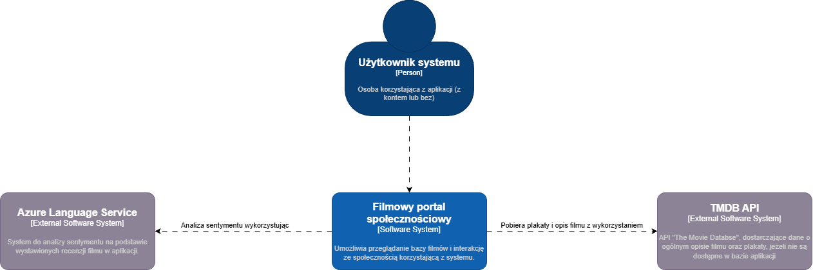
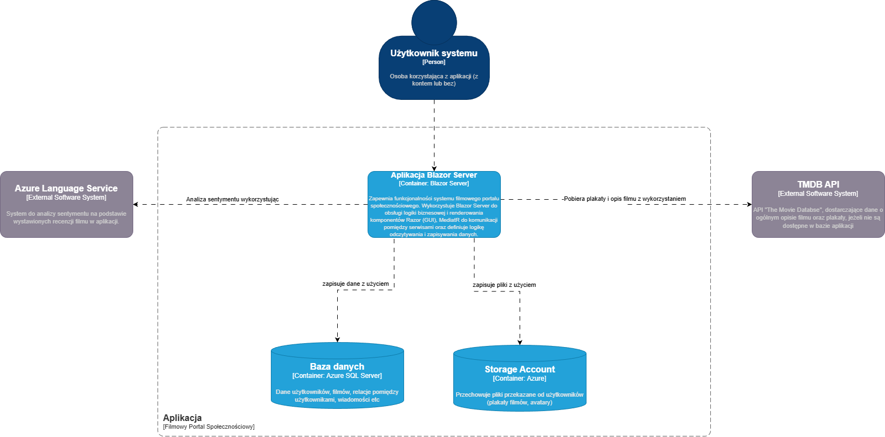

# Wprowadzenie
Projekt zawiera:
- projekt aplikacji webowej "Filmowy portal społecznościowy"
- projekt ETL, odpowiadający za przeprocesowanie i załadowanie początkowych danych, zawartych w [datasetach IMDb](https://developer.imdb.com/non-commercial-datasets/)

# Architektura projektu
- Aplikacja monolityczna, n-warstwowa
- Warstwy i podział ich odpowiedzialności:
    - Warstwa prezentacji
        - Komponenty graficzne Razor: przyciski, dialogi, strony, formularze, spersonalizowane komponenty,
        - Odpowiada folderowi "Components" w strukturze projektu
    - Warstwa Biznesowa
        - Definiuje: logikę biznesową aplikacji, połączenia do zewnętrznych API, system uwierzytelnienia, autoryzacji
        - Odpowiada folderom: Services, Hubs, Events w strukturze projektu
    - Warstwa danych
        - Definiuje schemat bazy i modele danych aplikacji,
        - zapisuje dane do bazy danych SQL przy użyciu Entity Framework Core,
        - zapisuje pliki do Azure Blob (Storage Account),
        - Odpowiada folderom: Migrations, Data w strukturze projektu

## C4 Model Context Diagram 


## C4 Model Container Diagram


# Jak uruchomić aplikację

1. Wymagania wstępne
- Instalacja [Visual Studio](https://visualstudio.microsoft.com/) lub [JetBrains Rider](https://www.jetbrains.com/rider/)
- Utworzona instancja SQL Server [w Azure](https://azure.microsoft.com/en-us/products/azure-sql/database) lub [lokalnie](https://www.microsoft.com/en-us/sql-server/sql-server-downloads)
- Utworzona Resource Grupa na wymagane usługi w Azure ([Language Services](https://learn.microsoft.com/en-us/azure/ai-services/language-service/overview), [Blob Storage](https://learn.microsoft.com/en-us/azure/storage/blobs/)) (wymaga subskrypcji)

- Paczki NuGet, które powinny być zainstalowane do uruchomienia projektu:

| Id                                                   | Wersja  | Nazwa projektu |
|------------------------------------------------------|-----------|-------------|
| Microsoft.Extensions.Configuration.UserSecrets       | {9.0.11}  | s20601      |
| Azure.Storage.Files.Shares                           | {12.23.0} | s20601      |
| Azure.Storage.Queues                                 | {12.23.0} | s20601      |
| CurrieTechnologies.Razor.Clipboard                   | {1.6.0}   | s20601      |
| Azure.AI.TextAnalytics                               | {5.3.0}   | s20601      |
| Microsoft.EntityFrameworkCore.SqlServer              | {9.0.10}  | s20601      |
| Extensions.MudBlazor.StaticInput                     | {3.2.1}   | s20601      |
| TMDbLib                                              | {2.3.0}   | s20601      |
| Microsoft.Extensions.Azure                           | {1.13.1}  | s20601      |
| MudBlazor                                            | {8.9.0}   | s20601      |
| Microsoft.AspNetCore.Identity.EntityFrameworkCore    | {9.0.10}  | s20601      |
| Microsoft.AspNetCore.Diagnostics.EntityFrameworkCore | {9.0.10}  | s20601      |
| Azure.Data.Tables                                    | {12.11.0} | s20601      |
| Microsoft.AspNetCore.SignalR.Client                  | {9.0.11}  | s20601      |
| Azure.Storage.Blobs                                  | {12.27.0} | s20601      |
| Microsoft.EntityFrameworkCore.Tools                  | {9.0.10}  | s20601      |
| MediatR                                              | {14.0.0}  | s20601      |
| Microsoft.Extensions.Configuration.UserSecrets       | {9.0.11}  | ETL         |
| Microsoft.EntityFrameworkCore                        | {9.0.11}  | ETL         |
| CsvHelper                                            | {33.1.0}  | ETL         |

2. Sklonuj repozytorium
```bash
git clone https://github.com/vpvrple/s20601.git
```

3. Otwórz plik solution (`s20601.sln`) przy użyciu Visual Studio lub Jetbrains Rider

4. Inicjalne załadowanie danych do bazy (opcjonalnie)
- Pobierz [datasety IMDb](https://developer.imdb.com/non-commercial-datasets/) i umieść rozpakowane foldery w lokalizacji `s20601\ETL\bin\Debug\net9.0`
- Utwórz instancję serwera SQL Server,
- Dostosuj Connection String w User Secrets projektu ETL
    - Przykładowa struktura pliku
    ```json
    {
        "ConnectionStrings:DefaultConnection": "<Connection String>"
    }
    ```
- Zbuduj i uruchom projekt ETL (skrót klawiszowy `Ctrl+F5` w Visual Studio)

5. Uzupełnij connection stringi i klucze w User Secrets dla projektu s20601
```json
{
  "Logging": {
    "LogLevel": {
      "Default": "Information",
      "Microsoft.AspNetCore": "Warning"
    }
  },
  "Tmdb": {
    "ApiKey": "<Api key TMDB>"
  },
  "ConnectionStrings": {
    "DefaultConnection": "<Connection string do bazy danych SQL>"
  },
  "Azure": {
    "ConnectionStrings": {
      "BlobStorage": "Connection string do BlobStorage Azure"
    },
    "Endpoints": {
      "LanguageServices": "Endpoint do Language Services"
    },
    "Keys": {
      "LanguageServicesKey": "Language Service Key"
    }
  }
}
```
6. Zbuduj i uruchom projekt s20601 (skrót klawiszowy `Ctrl+F5` w Visual Studio)